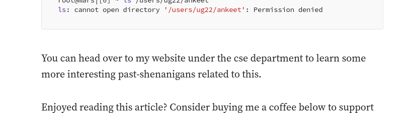

## Solution
The description indicates that this person has "hacked" the institute before. Searching `CSeC IITB Core Team Members` returns the website `cseciitb.github.io` in which we can go through the past team members. Notice that the 2022-23 team had a different nomeneclature of the council members and thus there were no "Core Team Members" in that year. That leads us to the 2023-24 team which had 6 CTMs.

Searching online about each CTM's name + Hacked IITB, leads us to a [medium article](https://me-ankeet.medium.com/how-i-hacked-iit-bombay-cse-mars-server-linux-privilege-escalation-9f4c8161e43f) by Ankeet Saha. Here he explains how he found a vulnerability in the CSE department's mars servers. Near the bottom of the article, we see him write 

Notice that the problem description also mentions the phrase 'past-shenanigans' including the hyphen.

Searching "Ankeet Saha CSE IITB" doesn't result any good results so we have to manually find him on the cse website. Go to `cse.iitb.ac.in` -> People -> Students and go through all years to find him in BTech3. Clicking on his entry we get redirected to his website: [`www.cse.iitb.ac.in/~ankeet`](https://www.cse.iitb.ac.in/~ankeet)

Now going through his website we dont find anything interesting, especially no mention of any past-shenanigans. However going to [`www.cse.iitb.ac.in/~ankeet/past-shenanigans`](https://www.cse.iitb.ac.in/~ankeet/past-shenanigans) does not return a 404 error + redirect. Instead it gives us a rickroll video. The flag is on the same page in white font, which can be detected by going to page-source or Ctrl-A.
